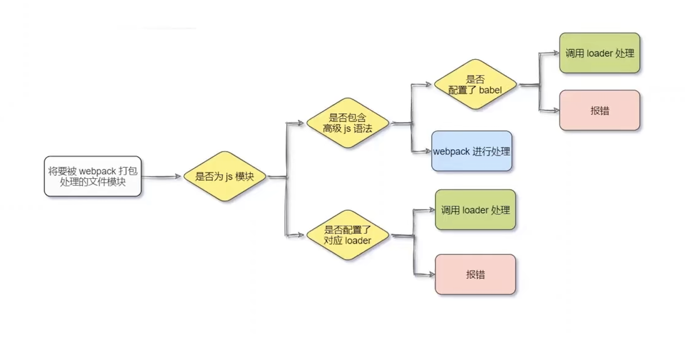

# webpack 中的loader

## loader
### 1. loader 概述
在实际开发中，webpack 只能打包处理 .js 后缀名结尾的模块。其他非 .js 后缀结尾的模块，webpack 默认处理不了，需要调用 loader 加载器才能正常打包，否则会报错。

loader 加载器的作用： 协助 webpack 打包处理固定的文件模块。比如：

- css-loader 可以打包 .css 相关的文件
- less-loader 可以打包处理 .les 相关文件
- babel-loader 可以打包处理 webpack 无法处理的高级 js 语法

下图是loader 的调用过程


### 2. 使用案例

**（1）问题产生**

在源代码 `src` 目录创建一个 `css` 目录，并创建文件 `index.css`，添加以下代码：
```css
li {
	list-style: none;
}
```
以上css代码的目的是去除列表 前面的“小点”

然后在`index1.js`文件头部导入css,如下代码
```javascript
// 使用es6语法，导入jquey
import $ from "jquery";
// 导入样式（在webpack中，一切皆模块，都可以通过es6导入语法进行导入和使用）
import './css/index.css';
```

但是，当我们运行实时编译命令的时候，发现存在如下图的错误


**（2）解决办法**

此问题是由于webpack 不能解决css文件引起，我们需要安装css-loader，让 webpack能够处理css

运行`npm i style-loader@3.0.0 css-loader@5.2.6 -D`命令，安装处理css文件的loader

在`webpack.config.js`的module -> rules 数组中，添加loader规则如下
```javascript
module: { // 所有第三方模块的匹配规则
	rules: [ // 文件后缀名匹配规则
	  { test: /\.css$/, use: ['style-loader', 'css-loader'] }
	]
}
```

其中，`test` 表示匹配的文件类型，`use`表示对应要调用的 `loader`

注意：
- use 数组中指定的 loader 顺序是固定的
- 多个 loader 的调用顺序是：从后往前调用

此时，我们再次运行编译命令，可以看到浏览器的 样式已经实现。


### 3. 总结
（1）webpack 默认只能处理.js 结尾的文件，处理不了其他后缀的文件

（2）由于代码中包含了`index.css`这个文件，因此webpack默认处理不了

（3）当webpack发现某个文件处理不了的时候，会查找`webpack.config.js`这个【配置文件，看module.rules数组中，是否配置了对应的loader加载器

（4）webpack把`index.css`这个文件先转交给最后一个loader进行处理（县转交给css-loader）

（5）当css-loader处理完成之后，会把处理结果转交给下一个loader（转交给style-loader）

（6）当style-loader处理完成之后，发现没有下一个loader了，于是就把处理的结果转交给webpack

（7）webpack把style-loader处理的结果合并到 `/dist/bundle.js` 中，最终生成打包好的文件

### 4. 使用less-loader
我们在 `src/css`目录县添加 `index.less` 文件，添加以下样式代码
```stylesheet
html, body, ul{
	margin: 0;
	padding: 0;
	li {
		line-height: 30px;
		padding-left: 20px;
		font-size: 12px;
	}
}
```

然后在`index1.js` 文件中引入，如下代码
```javascript
// 引入less样式
import './css/index.less';
```

此时，自定编译的命令行终端再次报错，原因是我们没有配置对应的less加载器。

使用以下方式对less文件进行打包处理

运行 `npm i less-loader@10.0.1 less@4.1.1 -D`命令

在webpack.config.js 的 module->rules数组中，添加loader规则如下：
```javascript
module: {
	rules: [
	  { test: /\.less$/, use: ['style-loader', 'css-loader', 'less-loader'] }
	]
}
```

从新运行编译命令，终端不再报错，并已实现效果


### 5. 加在图片

网页在加在图片的时候，实际上是使用`img`标签加在网页远端的互联网图片，实际上图片可以转成 base64 的字符串，如果是很小的图片，我们就可以使用 base64 字符串的方式加载，减少了再一次请求互联网带来的时间延迟。这也算是前端性能优化的一个小手段。

不过，base64的字符串实际上比原图片占用的空间稍微大一点，所以大图片并不是和转成base64的图片。


接下来介绍打包处理样式表中与url 路径相关的文件。
运行 `npm i url-loader@4.1.1 file-loader@6.2.0 -D`命令，在`webpack.config.js`的module->rules数组中，添加 loader 规则如下：

```javascript
module: {
	rules: [
	  { test: /\.jpg|png|gif$/, use: 'url-loader?limit=22229' }
	]
}
```
其中，在 `?` 之后是loader 的参数项
- limit：用来指定图片的大小，单位是字节（byte）
- 只有 <= limit 大小的图片，才会被转为 base64 格式的图片


接下来，我们动态地在界面上加在一张图片，打开 `index.html` 文件，在`<body>`节点借书前添加 `img`标签，如下代码：
```html
<!-- 需求：把 src/images/logo.jpg 设置给 src 属性 -->

</body>
```

后在 `index1.js` 中导入图片，得到图片文件，并加载到 img 标签，如下代码
```javascript
// 1. 导入图片，得到图片文件
import logo from './img/logo.png'

// 2. 给img标签的 src 动态赋值
$('.box').attr('src', logo)
```

重新编译，即可成功看到浏览器成功加载了图片，如果我们使用 `console.log(logo)` 将 `logo` 打印出来，将看到的是base64 的字符串


