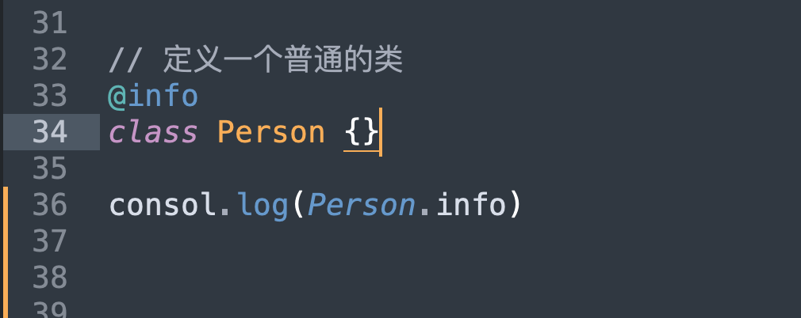

# SourceMap

## 一、什么是SourceMap?

SourceMap 是一个信息文件，里面存储着位置信息。也就是说，SourceMap 文件中存储着压缩混淆后的代码，所对应转换前的位置。有了它，出错的时候，工具将直接显示原始代码，能够极大的方便后期的调试。


## 三、默认SourceMap的问题

在开发环境下，默认生成的SourceMap，记录的是生成后代码的位置。会导致运行时报错的行数与源代码的运行数不一致的问题。如下图，我们故意写错一行代码，可以看到浏览器中报错的行数和实际的行数并不一致：


浏览器中报错的行数在第 35 行：


实际代码在第36行：



解决办法：
开发环境下，可以在 `webpack.config.js` 中添加如下的配置，即可保证运行时报错的行数与源代码行数保持一致
```javascript
module.exports = {
	mode: 'development',
	// eval-source-map 仅限在“开发模式”下使用，不建议在“生产模式”下使用
	// 此项生成的 SourceMap 能够保证 “运行时的错误所在代码行数” 与源代码保持一致
	devtool: 'eval-source-map',
	// 其他配置 .....
}
```

配置好之后重新运行编译命令，可以看到 在浏览器里 “报错的代码所在行数” 和源代码一致。在生产环境中，如果省略了 devtool 选项，则最终生成的文件中不包含 SourceMap。这能够防止 原始代码通过 SourceMap 的形式暴露给别有所图的人。在生产环境下，如果只想定位报错的具体行数，且不想暴露源代码。此时可以将 devtool 的值设置为 `nosources-source-map`。如下图：


所以，为了安全起见，在实际发布项目的时候，可以设置 `devtool: 'nosources-source-map'` 或者直接关闭 SourceMap


## 最佳实践

**（1）开发环境**

- 建议把 devtool 的值设置为 eval-source-map
- 好处：可以精准定位到具体的错误行号

**（2）生产环境**
- 建议关闭 SourceMap 或将 devtool 的值设置为 nosources-source-map
- 好处：防止源码泄漏，提高网站的安全性


